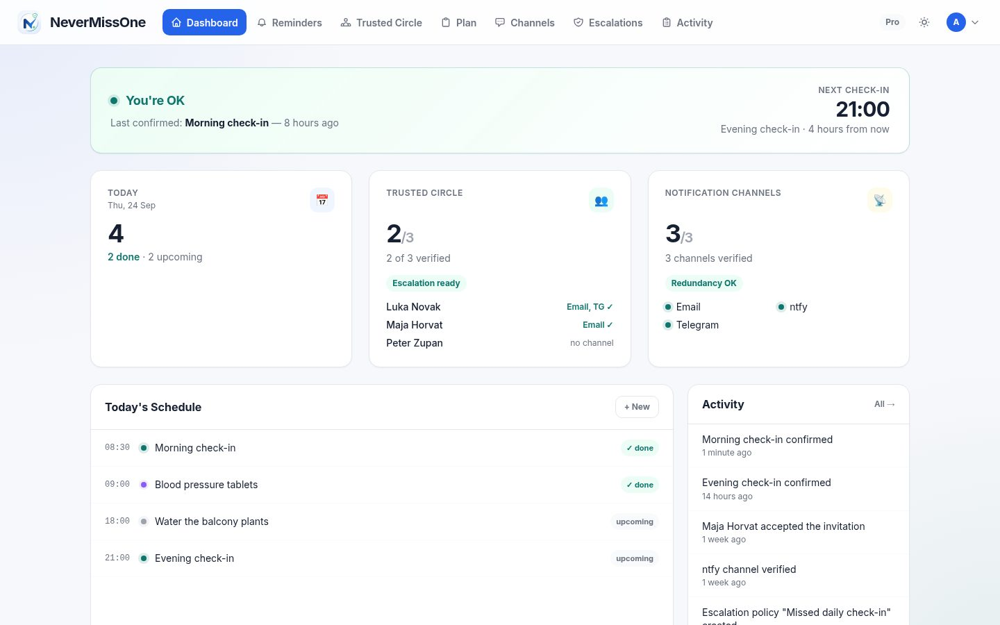
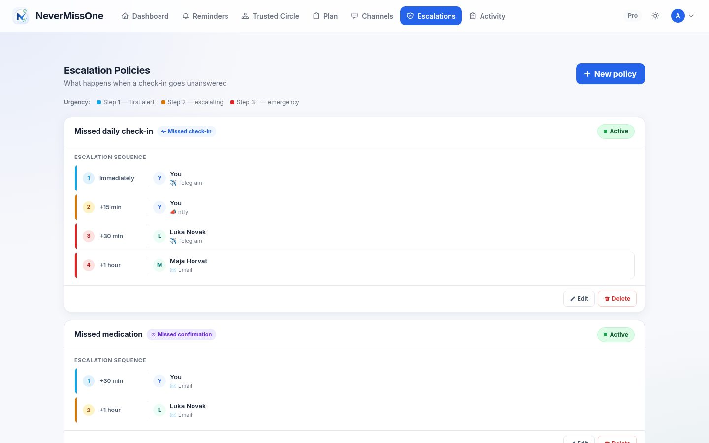
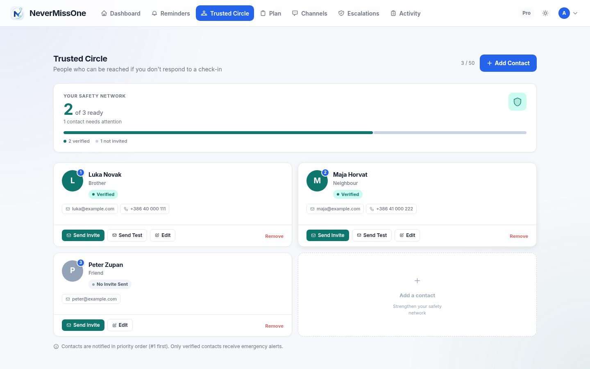
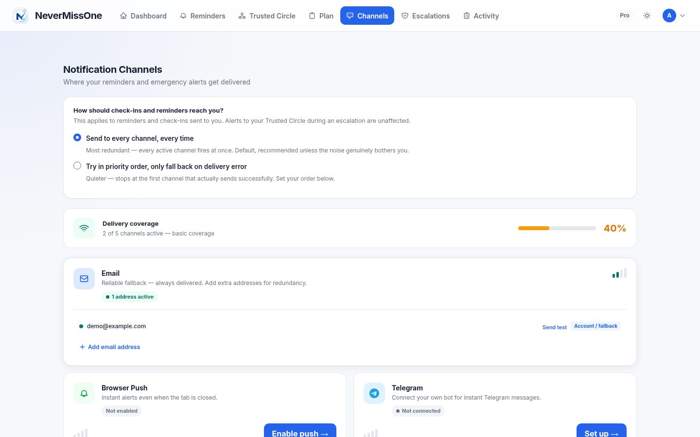
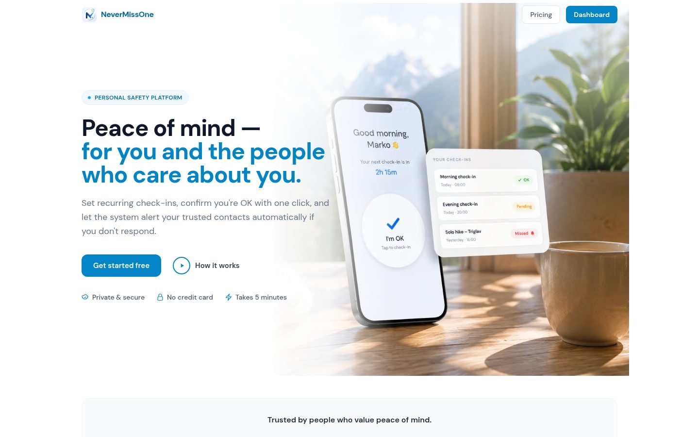

# NeverMissOne

**Reminders and safety check-ins that escalate to trusted contacts when you don't respond.** NeverMissOne is a web platform for people who live alone: it sends reminders and scheduled "I'm OK" check-ins, and if a check-in goes unanswered, it works through an escalation plan that ends with your emergency contacts being alerted.

It runs as a subscription service at [nevermiss.one](https://nevermiss.one) with Free, Standard and Pro plans, and installs as a progressive web app on phones and desktops.



> Screenshots show a demo instance with sample data.

| Escalation policies | Trusted Circle |
|---|---|
|  |  |
| **Notification channels** | **Landing page** |
|  |  |

## Features

- **Reminders.** One-off or recurring (daily, weekly, monthly or a custom recurrence rule), generated ahead as individual occurrences in the user's time zone.
- **Check-ins that need an answer.** A check-in counts only when confirmed. If the confirmation window passes, the occurrence is marked missed, a soft nudge goes out first, and escalation starts if that also goes unanswered.
- **Escalation policies.** Ordered steps, each with its own delay, channel and recipient: first you on another channel, then your contacts.
- **Trusted Circle.** Emergency contacts are invited by a token link and need no account. When escalation fires, they see an alert page with the emergency plan you wrote in advance.
- **Several delivery channels.** Email, browser push, Telegram, Viber and ntfy, each verified before use. Delivery attempts are logged and failed sends are retried.
- **Paired devices.** A small device can be paired with an account through a short pairing flow and then show check-in status and confirm check-ins through a token-authenticated API.
- **Accounts and security.** Password login, Google and GitHub sign-in, TOTP two-factor authentication with trusted devices, and an audit log of notifications and actions.
- **Billing.** Stripe subscriptions with a customer portal; plan limits are enforced automatically when a subscription changes.
- **Engagement.** A weekly digest email, check-in streaks, referrals and a feature poll where users vote on what comes next.
- **Administration.** A dashboard with signups, churn, active users and recurring revenue; user, plan, escalation and notification views; failed-job inspection; bot management; and drafts for outreach posts with tracked links.
- **Operations.** Scheduler and queue heartbeats behind a health endpoint that shows when background processing has stopped, daily backups with monitoring and disk-space limits, and error tracking with Sentry.

## Tech stack

PHP · Laravel · MariaDB · Blade · Tailwind CSS · Vite · Laravel Cashier (Stripe) · Socialite · Sanctum · Web Push · Telegram and Viber bots · ntfy · Sentry · Spatie Backup · PHPUnit

## How it works

```
scheduler (every minute / 15 min)
  generate occurrences ──► send due ──► detect missed ──► soft-check nudge
                                                              │ no answer
                                                              ▼
                                            escalation steps (delay, channel, recipient)
                                                              │
queue workers ──► notification router ──► email · push · Telegram · Viber · ntfy
```

Reminder occurrences move through a status lifecycle (pending, sent, confirmed, missed), and every notification goes through one router that picks the channel implementation, records the attempt and schedules retries. Telegram and Viber bots use webhooks to link a user's or contact's chat to their account. All background work runs on Laravel's own scheduler and queue, with no third-party queue service.

## Status

The service is live in beta. WhatsApp delivery is stubbed in the code but not implemented. Organisation accounts for lone-worker safety are an idea on the roadmap, not a feature.

## Availability

The source code is not public. NeverMissOne is operated by Munda Plus at [nevermiss.one](https://nevermiss.one). The platform is also available for licensing, custom deployment or white-label adaptation. Get in touch via [munda.si](https://www.munda.si/#contact).

## License

Proprietary. © 2026 MUNDA PLUS d.o.o. All rights reserved. See [LICENSE](LICENSE).

## Author

Built by [Marko Munda](https://www.munda.si/) · [Munda Plus](https://github.com/MundaPlus)
